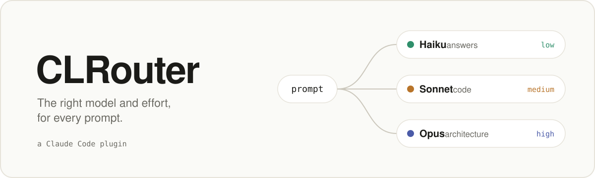

<picture>
  <source media="(prefers-color-scheme: dark)" srcset="assets/banner-dark.svg">
  
</picture>

<p align="center">
  <a href="#install">Install</a> ·
  <a href="docs/how-it-works.md">How it works</a> ·
  <a href="bench/thai-tax">Benchmarks</a> ·
  <a href="README.th.md">ภาษาไทย</a>
</p>

Running Opus at high effort on every prompt is the expensive default. CLRouter picks the model and the effort per prompt, from what each one was measured to be good at, and asks before it switches.

```
 CLRouter
 Haiku fits this prompt (question or explanation). Run it on Haiku at low effort instead of Opus?

 ❯ 1. Use Haiku for this prompt
   2. Keep Opus
   3. Auto-route this session
   4. Turn off this session
```

## Measured, not guessed

One task, a Thai income tax web app, given to each model and scored by 20 hidden tests:

| Model and effort | Cost | Hidden tests | Note |
| :-- | --: | :-: | :-- |
| Opus · high | $0.56 | 19/20 | |
| **Sonnet · medium** | **$0.16** | **20/20** | |
| Haiku · medium | $0.07 | 18/20 | The page looked finished, but the tax was wrong. |

So code goes to Sonnet, answers go to Haiku, and tax or money rules never go to Haiku. [All results →](bench/thai-tax)

## Install

In Claude Code:

```
/plugin install clrouter --marketplace thanyatornklin19/CLRouter
```

It works with an API key or a Pro/Max plan.

## What it does

- **Picks the model.** Answers go to Haiku, code and exact rules to Sonnet, architecture and security to Opus.
- **Picks the effort.** Low for answers, medium for code, high for deep work. Never max.
- **Switches only when it's cheaper**, counting the cache it has to rebuild.
- **Learns your answers.** Say yes twice and it stops asking. Say no three times and it stops offering.
- **Shows what it saved**, in dollars and in your five-hour window:

```
› /clrouter stats
CLRouter, last 7 days: 212 turns.
- Sent to another model: 64 (Haiku 51, Sonnet 13). Effort only: 98. Left alone: 50.
- Those turns cost $0.41. On your session's model they'd have cost at least $2.90: saved at least $2.49.
- Five-hour window used per turn: Haiku 0.1%, Sonnet 0.8%, Opus 2.3%.
```

<sub>Example output. Yours comes from your own turns.</sub>

## Commands

| Command | What it does |
| :-- | :-- |
| `/clrouter` | Shows the mode, what it has learned, and the last call it made. |
| `/clrouter stats [days]` | Shows cost, savings and the five-hour window. |
| `/clrouter test <prompt>` | Shows which model and effort a prompt gets, and why. |
| `/clrouter ask \| auto \| suggest \| off` | Sets the mode for this session. |
| `/clrouter forget` | Clears your learned answers. |
| `/clrouter:dev <task>` | Writes locked tests, then has the cheapest model that passes them write the code. Experimental. |

## Good to know

- **Beta.** It's built on Claude Code's early-access plugin API (tested on 2.1.295), which can change.
- **Accuracy.** On prompts it was never tuned on, it picked right 14 times in 20. It never sent code or exact rules to Haiku.
- **Savings are a floor.** They are never overstated, and a loss is shown as a loss.
- **Not measured yet:** routing for Opus-level work, and the five-hour reading on a real Pro account.

<sub>[How it works](docs/how-it-works.md) · [Benchmarks](bench/thai-tax) · MIT</sub>
